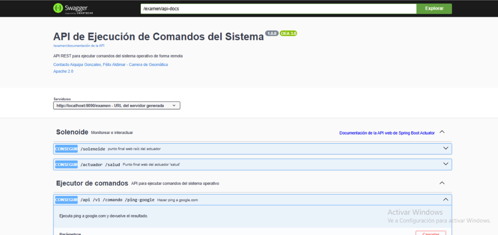

<div align="center">

# 🌐 GEMATICA API
### *Sistema de Ejecución y Orquestación Remota de Comandos*



[](https://www.oracle.com/java/)
[](https://spring.io/projects/spring-boot)
[](https://swagger.io/)
[](https://maven.apache.org/)

</div>

---

## 🚀 **Introducción**

Bienvenido a **GEMATICA**, un entorno de **software de alto rendimiento** diseñado para la **orquestación y ejecución remota de comandos**. Esta herramienta no es simplemente una API; es un **centro de comando** táctico que puentea la brecha entre la web y el sistema operativo subyacente.

Construido sobre la robustez de **Java 21** y la agilidad de **Spring Boot**, GEMATICA ofrece una interfaz segura y documentada para interactuar directamente con la terminal del servidor, permitiendo a los desarrolladores y administradores de sistemas ejecutar operaciones críticas, monitorear el estado del sistema y automatizar flujos de trabajo complejos a través de endpoints REST estandarizados.

> *"El poder de la terminal, la flexibilidad de la web."*

---

## ⚡ **Funcionalidades Principales**

Este entorno "SWAT" (Software Web Administration Tool) proporciona capacidades avanzadas:

| Módulo | Descripción |
| :--- | :--- |
| **📟 Ejecución de Comandos** | Envía comandos de sistema (CMD/Bash) y recibe la salida estándar y de error en tiempo real a través de JSON. |
| **🖥️ Información del Sistema** | Obtén métricas vitales del servidor (OS, Arquitectura, Versión de Java, Directorios de Usuario) con un solo request. |
| **🛡️ Health Checks** | Monitoreo activo del estado de la aplicación mediante Spring Actuator. |
| **📚 Documentación Viva** | Interfaz **Swagger UI** integrada para probar y visualizar todos los endpoints disponibles sin escribir una sola línea de código cliente. |

---

## 🛠️ **Stack Tecnológico**

El núcleo de GEMATICA está forjado con tecnologías de vanguardia para asegurar estabilidad y escalabilidad:

*   **Core**: Java Development Kit (JDK) 21
*   **Framework**: Spring Boot 3.2.6
*   **Build Tool**: Apache Maven
*   **Documentation**: SpringDoc OpenAPI (Swagger)
*   **Logging**: SLF4J & Logback

---

## 📖 **Guía de Inicio Rápido**

Sigue estos pasos para desplegar tu centro de comando:

### 1. Prerrequisitos
Asegúrate de tener instalado **Java 21** y **Maven**.

### 2. Instalación

```bash
# Clona el repositorio
git clone https://github.com/tu-usuario/gematica.git

# Navega al directorio
cd gematica

# Compila el proyecto
mvn clean install
```

### 3. Despliegue

```bash
# Ejecuta la aplicación
mvn spring-boot:run
```

La aplicación iniciará en el puerto **8080** por defecto.

---

## 📡 **Acceso a la API**

Una vez desplegado, accede a la documentación interactiva y endpoints:

*   **Swagger UI (Panel de Control)**: `http://localhost:8080/swagger-ui.html`
*   **API Docs (JSON)**: `http://localhost:8080/v3/api-docs`

### Ejemplo de Uso (CURL)

**Ejecutar un comando simple (`dir` o `ls`):**

```bash
curl -X 'POST' \
  'http://localhost:8080/api/v1/command/execute' \
  -H 'Content-Type: application/json' \
  -d '{
  "command": "cmd.exe",
  "arguments": "/c dir",
  "timeout": 10
}'
```

---

## ⚠️ **Aviso de Seguridad**

> **Precaución**: Esta herramienta otorga privilegios de ejecución de comandos en el servidor anfitrión. Asegúrese de implementar capas de seguridad adicionales (como Spring Security, Firewalls, o VPNs) antes de desplegar en un entorno productivo público. El poder conlleva responsabilidad.

---

<div align="center">

Desarrollado con ❤️ por el equipo de **Gematica**
<br>
&copy; 2025 Todos los derechos reservados.

</div>
